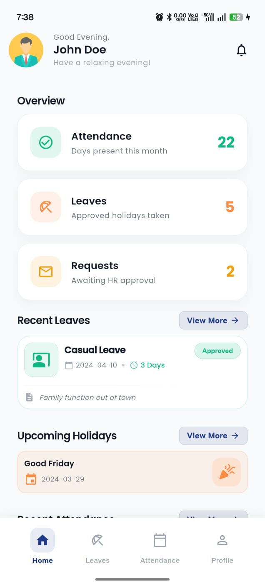
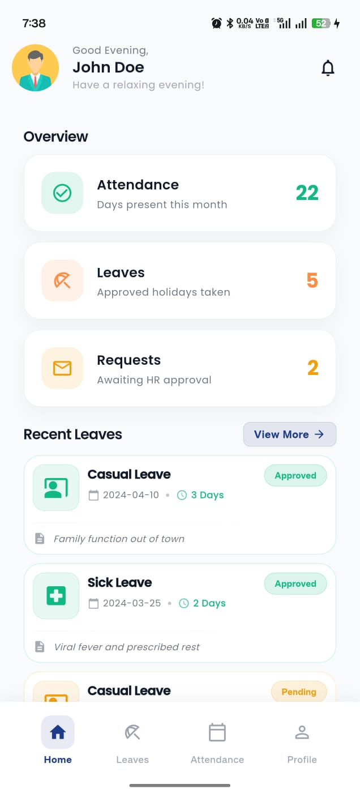
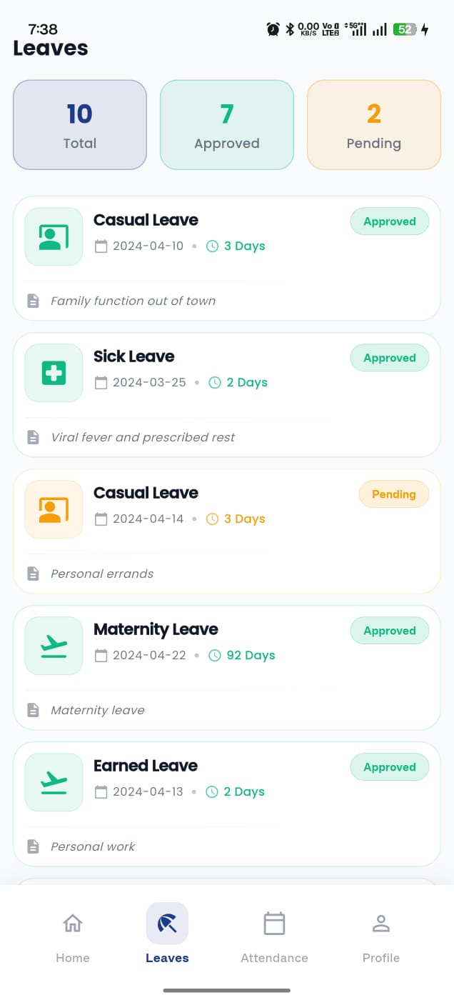
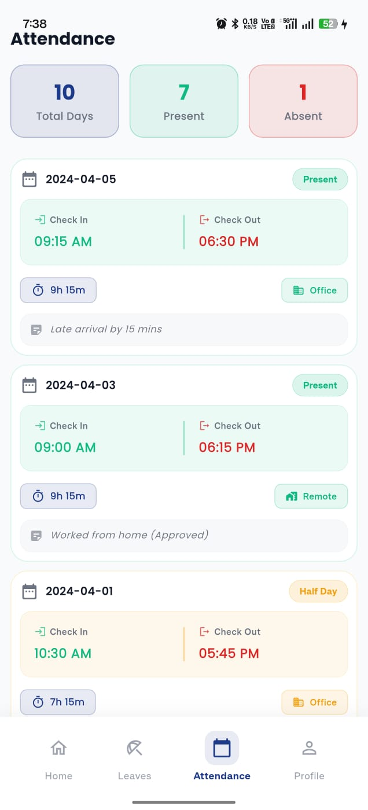
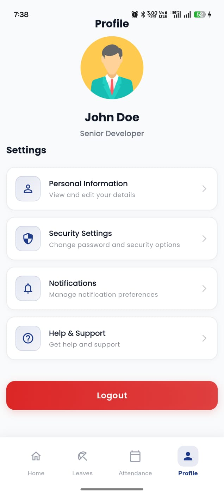

# 🎯 CoreDesk - Employee Dashboard Application

> A modern, responsive Flutter application that provides employees with a personalized dashboard to track their attendance, manage leave requests, view company holidays, and manage their profile information.

**Version:** 1.0.0  
**Status:** Production Ready  
**Platform:** Android, iOS, Web, Windows, macOS, Linux

---

## 📋 Table of Contents

- [Project Overview](#-project-overview)
- [📸 Screenshots](#-screenshots)
- [APK Download](#-apk-download)
- [🚀 Installation Guide](#-installation-guide)
- [🏗️ Architecture Overview](#-architecture-overview)
- [🛠️ Technology Stack](#-technology-stack)
- [🎨 Key Features](#-key-features)
- [📱 Responsive Design](#-responsive-design)
- [🔑 Key Architectural Decisions](#-key-architectural-decisions)
- [📂 Project Structure](#-project-structure)
- [📊 State Management](#-state-management)
- [🌐 API Integration](#-api-integration)
- [🎯 Development Guidelines](#-development-guidelines)
- [📝 License](#-license)

---

## 📖 Project Overview

**CoreDesk** is a modern, user-friendly Employee Dashboard application built with **Flutter**, designed to give employees easy access to their work-related information in one place. The application follows **Clean Architecture** principles with clear separation between presentation, domain, and data layers, ensuring maintainability, scalability, and testability.

### What is CoreDesk?

CoreDesk is a comprehensive employee-centric dashboard application that allows employees to:
- **View Attendance Records** - Check daily attendance history, check-in/check-out times, and work hours
- **Manage Leave Requests** - Apply for leaves, track approval status, and view leave history
- **View Company Holidays** - See upcoming organizational holidays and celebration dates
- **Personal Dashboard** - Quick overview of attendance summary, leave balance, and pending requests
- **Profile Management** - Manage personal information and view employee details

### Key Highlights

| Metric | Value |
|--------|-------|
| **Responsive Design** | 360px to 1200px+ width support |
| **Supported Platforms** | Android, iOS, Web, Windows, macOS, Linux |
| **Architecture Pattern** | Clean Architecture + BLoC |
| **State Management** | Flutter BLoC with pagination |
| **Data Display** | Pagination support for large datasets |
| **Error Handling** | Comprehensive exception hierarchy with retry logic |
| **UI Framework** | Material Design 3 |
| **Code Organization** | Feature-based modular architecture |
| **Testing Ready** | Built-in mock data (20+ entries per list) |

---

## 📸 Screenshots

### 1. **Authentication Screen**


   - Email/Password login with validation
   - Error handling and user feedback
   - Password visibility toggle

---

### 2. **Dashboard Home Screen**


   - Overview statistics (Attendance, Leaves, Requests)
   - Greeting card with user information
   - Recent leaves list with expandable view
   - Upcoming holidays calendar
   - Pull-to-refresh functionality

---

### 3. **Leaves Management Screen**


   - List of all leaves with pagination (20+ entries)
   - Leave status indicators (Approved, Pending, Rejected)
   - Apply new leave functionality
   - Leave details and history
   - Filter by status

---

### 4. **Attendance Screen**


   - Daily attendance records with pagination (20+ entries)
   - Check-in/check-out times
   - Work hours calculation
   - Location details (Office, Remote, Client Site)
   - Attendance status (Present, Absent, Half Day)

---

### 5. **Profile Screen**


   - Employee information display
   - Department and role details
   - Contact information
   - Edit profile functionality

---

## 📥 APK Download

> **Download CoreDesk APK:**
>
> # [📱 Download CoreDesk APK v1.0.0](https://drive.google.com/file/d/1TEAfXEbrGJSARfgzaTo63Aw2izjYytVQ/view?usp=drive_link)
>
> **Alternative Distribution:**
> - [GitHub Releases](https://github.com/Dev-Saurabhraj/coredesk/releases)
> - [Firebase App Distribution](https://firebase.google.com/docs/app-distribution)
>
> **APK Specifications:**
> - Size: ~50 MB
> - Minimum Android Version: 5.0 (API 21)
> - Target Android Version: 14 (API 34)

---

## 🚀 Installation Guide

### For End Users (APK Installation)

#### Android Installation Steps:
1. **Download** the APK file from the drive link above
2. Go to **Settings → Security** and enable **Unknown Sources**
3. Open the downloaded APK file
4. Tap **Install** and wait for installation to complete
5. Open CoreDesk application
6. Login using test credentials below

#### Default Test Credentials:
```
📧 Email: test@example.com
🔐 Password: password123
```

---

### For Developers

#### System Requirements

| Requirement | Version | Purpose |
|-------------|---------|---------|
| **Flutter SDK** | 3.11.4+ | Framework |
| **Dart SDK** | 3.11.4+ | Language (included with Flutter) |
| **JDK** | 11+ | Android build |
| **Xcode** | 12+ | iOS build (macOS only) |
| **Android SDK** | API 21+ | Android build |
| **Git** | Latest | Version control |

#### Installation Steps

**Step 1: Clone the Repository**
```bash
git clone https://github.com/Dev-Saurabhraj/coredesk.git
cd coredesk
```

**Step 2: Install Dependencies**
```bash
flutter pub get
```

**Step 3: Generate Flutter Launcher Icons (Optional)**
```bash
flutter pub run flutter_launcher_icons:main
```

**Step 4: Run Development Build**
```bash
# Run on default device
flutter run

# Run on specific device
flutter devices                    # List all connected devices
flutter run -d <device-id>        # Run on specific device

# Run with performance monitoring
flutter run --profile
```

**Step 5: Build for Release**

Android APK:
```bash
flutter build apk --release
```

Android Bundle (for Google Play):
```bash
flutter build appbundle --release
```

iOS build:
```bash
flutter build ios --release
```

Web build:
```bash
flutter build web --release
```

#### Common Troubleshooting

| Issue | Solution |
|-------|----------|
| **Gradle build fails** | Execute: `flutter clean && flutter pub get` |
| **Pod install errors (iOS)** | Run: `cd ios && pod repo update && pod install && cd ..` |
| **Device not detected** | Run: `flutter devices` to verify connected devices |
| **Permission denied on Linux** | Run: `chmod +x gradlew` in android directory |
| **Java version mismatch** | Install JDK 11+ and set `JAVA_HOME` environment variable |
| **Build cache issues** | Delete `build/` directory and run `flutter pub get` again |

---

## 🏗️ Architecture Overview

### Clean Architecture Pattern

CoreDesk implements **Clean Architecture** with three distinct, independent layers:

```
┌──────────────────────────────────────────────────────┐
│         PRESENTATION LAYER (Pages, BLoC, UI)         │
│  Handles: User interaction, State management, UI     │
└──────────────────────────────────────────────────────┘
                         ↓
┌──────────────────────────────────────────────────────┐
│    DOMAIN LAYER (Entities, Repositories, Use Cases)  │
│  Handles: Business logic, pure Dart (framework agnostic) │
└──────────────────────────────────────────────────────┘
                         ↓
┌──────────────────────────────────────────────────────┐
│  DATA LAYER (API Services, Models, Local Storage)    │
│  Handles: Data fetching, storage, serialization      │
└──────────────────────────────────────────────────────┘
```

### Directory Structure

```
coredesk/
├── lib/
│   ├── main.dart                          # App entry point
│   ├── app.dart                           # App configuration & routing
│   │
│   ├── features/                          # Feature modules
│   │   ├── authentication/
│   │   │   ├── data/
│   │   │   │   ├── datasources/
│   │   │   │   ├── models/
│   │   │   │   └── repositories/
│   │   │   ├── domain/
│   │   │   │   ├── entities/
│   │   │   │   ├── repositories/
│   │   │   │   └── usecases/
│   │   │   └── presentation/
│   │   │       ├── bloc/
│   │   │       ├── pages/
│   │   │       └── widgets/
│   │   │
│   │   ├── dashboard/
│   │   │   ├── data/
│   │   │   │   ├── datasources/
│   │   │   │   ├── models/
│   │   │   │   └── repositories/
│   │   │   ├── domain/
│   │   │   ├── presentation/
│   │   │   │   ├── bloc/
│   │   │   │   ├── pages/
│   │   │   │   ├── widgets/
│   │   │   │   └── helpers/
│   │   │
│   │   ├── leaves/                       # Pagination included
│   │   │   ├── data/
│   │   │   ├── domain/
│   │   │   └── presentation/
│   │   │
│   │   ├── attendance/                   # Pagination included
│   │   │   ├── data/
│   │   │   ├── domain/
│   │   │   └── presentation/
│   │   │
│   │   └── profile/
│   │       ├── data/
│   │       ├── domain/
│   │       └── presentation/
│   │
│   ├── core/                             # Core utilities
│   │   ├── network/
│   │   │   ├── dio_client.dart          # HTTP client (retry logic, pagination)
│   │   │   ├── mock_api_data.dart       # Mock data (20+ entries each)
│   │   │   └── api_endpoints.dart
│   │   ├── exceptions/
│   │   │   └── exceptions.dart          # Custom exception hierarchy
│   │   ├── responsive/
│   │   │   ├── responsive_system.dart
│   │   │   ├── responsive_extensions.dart
│   │   │   └── responsive_widgets.dart
│   │   ├── theme/
│   │   │   ├── app_theme.dart
│   │   │   └── dark_theme.dart
│   │   ├── colors/
│   │   │   └── app_colors.dart
│   │   ├── constants/
│   │   ├── utils/
│   │   └── index.dart
│   │
│   ├── shared/                           # Reusable components
│   │   ├── widgets/
│   │   │   ├── app_bottom_navigation_bar.dart
│   │   │   ├── error_widgets.dart
│   │   │   └── responsive_widgets.dart
│   │   ├── services/
│   │   │   └── haptics_service.dart
│   │   └── providers/
│   │
│   ├── config/
│   │   └── dependencies.dart             # Dependency injection
│   │
│   ├── routes/
│   │   └── app_routes.dart              # Route definitions
│   │
│   └── index.dart
│
├── assets/                               # Static resources
│   ├── AppLogo/
│   ├── Icons/
│   └── Images/
│
├── android/                              # Android native
├── ios/                                  # iOS native
├── web/                                  # Web build
├── windows/                              # Windows build
├── macos/                                # macOS build
├── linux/                                # Linux build
│
├── pubspec.yaml                          # Dependencies
├── analysis_options.yaml                 # Linter rules
│
└── README.md                             # This file
```

---

## 🛠️ Technology Stack

### Core Dependencies

| Package | Version | Purpose |
|---------|---------|---------|
| **Flutter** | 3.11.4+ | UI Framework |
| **Dart** | 3.11.4+ | Programming Language |
| **BLoC** | 9.0.0+ | State Management |
| **GetIt** | 7.6.0 | Service Locator |
| **Dio** | 5.4.0 | HTTP Client |
| **GoRouter** | 17.2.0 | Navigation |
| **SharedPreferences** | 2.2.2 | Local Storage |
| **Equatable** | 2.0.8 | Value Equality |
| **GoogleFonts** | 8.0.2 | Typography |
| **Shimmer** | 3.0.0 | Loading Skeletons |
| **Intl** | 0.19.0 | Localization |

### Design System

- **Material Design 3** - Modern, adaptive UI
- **Responsive System** - Device-aware layouts
- **Custom Theme** - Consistent branding
- **Adaptive Typography** - Dynamic font sizing

---

## 🎨 Key Features

### 1. **Dashboard Overview** 📊
- Personal attendance summary
- Leave balance and statistics
- Pending leave requests
- Recent activities overview
- Pull-to-refresh functionality
- Quick navigation to detailed views

### 2. **Attendance Records** ⏰
- ✅ View daily attendance history
- 📍 Location information (Office/Remote/Client Site)
- ⏰ Check-in and check-out times
- 📊 Work hours calculation
- **Pagination support (20+ records)**
- 🔍 Status display (Present, Absent, Half Day, Leave)

### 3. **Leave Management** 📝
- 📋 View all leave records
- ✅ Track leave status (Approved, Pending, Rejected)
- 📅 Multiple leave types (Casual, Sick, Earned, Maternity, Paternity, etc.)
- 👤 Approval information
- **Pagination support (20+ entries)**
- 📊 Leave history and details

### 4. **Company Holidays** 🎉
- 📅 View all organizational holidays
- 🎪 Holiday names and dates
- 📍 Location-specific holidays
- 🔔 Holiday reminders

### 5. **User Authentication** 🔐
- 🔐 Secure email/password login
- ✔️ Input validation and error handling
- 📧 Remember me functionality
- 🔓 Logout with session cleanup
- 🛡️ Token-based authentication

### 6. **Employee Profile** 👤
- 👤 Personal information display
- 🏢 Department and designation details
- 📞 Contact information
- 📸 Profile picture/Avatar
- ✏️ Edit profile capability
- 🔔 Account preferences

---

## 📱 Responsive Design

### Device Breakpoints

| Category | Width | Devices |
|----------|-------|---------|
| **Extra Small** | 320-480px | Old phones |
| **Small** | 480-600px | Modern phones |
| **Medium** | 600-900px | Tablets, landscape |
| **Large** | 900px+ | Tablets, desktops |

### Responsive Utilities

```dart
// Access responsive system
context.responsive.horizontalPadding();
context.adaptiveFont.bodyLarge();
context.deviceCategory;

// Conditional rendering
if (context.isMediumScreen) {
  // Tablet layout
} else {
  // Mobile layout
}
```

### Adaptive Components

- Responsive padding and margins
- Dynamic font sizes
- Flexible grid layouts
- Device-specific widgets
- Landscape/portrait support

---

## 🔑 Key Architectural Decisions

### 1. **Clean Architecture**
**Decision:** Implement three-layer architecture (Presentation, Domain, Data)

**Rationale:**
- Clear separation of concerns - UI, business logic, and data handling are kept separate
- Easy to unit test - Each layer can be tested independently
- Framework independence - Business logic doesn't depend on Flutter
- Scalability - Easy to add new features without affecting existing code
- Team collaboration - Different developers can work on different layers

**Implementation:**
- Features as independent modules
- Repository pattern for data abstraction
- BLoC for state management separated from UI
- No cross-feature imports

---

### 2. **BLoC Pattern for State Management**
**Decision:** Use Flutter BLoC for state management

**Rationale:**
- Reactive programming model - Changes automatically propagate to UI
- Predictable state transitions - Events lead to specific state changes
- Excellent for complex features - Pagination, filtering, loading states
- Strong community support - Well-documented and widely used
- Easy debugging - Can track all state changes

**Real-world Example - Pagination:**
```dart
// User scrolls to end of list
event: LoadMoreLeavesEvent()
→ BLoC fetches next page
→ State updates with new leaves + pagination flags
→ UI rebuilds with more data
```

---

### 3. **Dio with Retry Logic**
**Decision:** Implement automatic retry mechanism for failed API requests

**Rationale:**
- Handle transient network failures gracefully
- Exponential backoff strategy prevents server overload
- Better user experience - Silent recovery from temporary issues
- Configurable retry behavior per endpoint
- Reduces manual error handling code

**Configuration:**
- Maximum 3 retries per request
- Exponential backoff: 1s, 2s, 4s delays
- Retryable status codes: 408, 429, 500, 502, 503, 504
- Connection timeout: 15 seconds
- Receive timeout: 30 seconds

---

### 4. **Responsive Design System**
**Decision:** Build custom responsive utilities instead of using third-party packages

**Rationale:**
- Perfect control over breakpoints matching app design
- No unnecessary external dependencies
- Consistent design language across app
- Easy to extend and customize
- Better performance without extra packages

**Implementation:**
- ResponsiveSystem class with device detection
- Context extensions for easy access throughout app
- Adaptive font sizing for readability
- Dynamic padding/margins for different screens

---

### 5. **Mock Data for Testing**
**Decision:** Include comprehensive mock data (20+ entries) for pagination testing

**Rationale:**
- Test pagination and list behavior without backend
- Verify UI works correctly with large datasets
- Catch performance issues early in development
- Serves as documentation through examples

**Coverage:**
- 20 leave entries with various types and statuses
- 20 holiday entries
- 20 attendance records with different scenarios

---

### 6. **Repository Pattern with Dependency Injection**
**Decision:** Abstract data sources with repositories and use GetIt for DI

**Rationale:**
- Swap implementations easily (real API vs mock data)
- Better testability - Can inject mock repositories in tests
- Single responsibility principle - Each class has one job
- Loose coupling - Components don't know about concrete implementations
- Clear dependencies - Easy to see what each feature needs

**Implementation:**
```dart
// Register in dependencies.dart
getIt.registerSingleton<LeaveRepository>(
  LeaveRepositoryImpl(
    remoteDataSource: getIt(),
  ),
);
```

---

### 7. **Feature-Based Code Organization**
**Decision:** Organize code by features rather than by layers

**Rationale:**
- Feature independence - Each feature is a self-contained module
- Easy to add/remove features - Just add/delete a folder
- Clear module boundaries - No ambiguity about where code belongs
- Faster navigation - All related code in one place
- Team scalability - Teams can own specific features

**Structure:**
```
feature/
├── data/          (Network calls, models)
├── domain/        (Business logic, entities)
└── presentation/  (UI, state management)
```

---

## 📊 State Management

### BLoC Architecture

```
User Interaction → Event → BLoC → State → UI Update
```

### Example: Leaves Pagination

```dart
// Events
class FetchLeavesEvent extends DashboardEvent {}
class LoadMoreLeavesEvent extends DashboardEvent {}

// State
class DashboardSuccess extends DashboardState {
  final List<LeaveModel> leaves;
  final bool isLoadingMore;
  final bool hasReachedMax;
  final int currentPage;
}

// BLoC
BlocBuilder<DashboardBloc, DashboardState>(
  builder: (context, state) {
    if (state is DashboardSuccess) {
      return ListView.builder(
        itemCount: state.leaves.length,
        itemBuilder: (context, index) {
          // Load more when reaching end
          if (index == state.leaves.length - 1 && !state.hasReachedMax) {
            context.read<DashboardBloc>().add(LoadMoreLeavesEvent());
          }
          return LeaveCard(leave: state.leaves[index]);
        },
      );
    }
    return LoadingWidget();
  },
);
```

---

## 🌐 API Integration

### Endpoints

| Endpoint | Method | Purpose | Pagination |
|----------|--------|---------|-----------|
| `/auth/login` | POST | User authentication | No |
| `/dashboard/stats` | GET | Statistics | No |
| `/leaves` | GET | List leaves | Yes (page, limit) |
| `/holidays` | GET | List holidays | No |
| `/attendance` | GET | List attendance | Yes (page, limit) |
| `/profile` | GET | User profile | No |

### Pagination Implementation

**Request:**
```
GET /leaves?page=1&limit=10
```

**Mock Data Response** (20+ entries total):
```dart
final mockLeavesResponse = [
  // Entry 1-20 (see mock_api_data.dart)
];

// DioClient automatically slices based on pagination
final page = (page - 1) * limit;
final data = mockLeavesResponse.sublist(page, page + limit);
```

### Error Handling

```dart
try {
  final data = await dioClient.get('/leaves');
} on ServerException {
  // Show server error
} on NetworkException {
  // Show network error
} on TimeoutException {
  // Show timeout error
} on AuthException {
  // Redirect to login
}
```

---

## 🎯 Development Guidelines

### Code Style

- Follow [Dart Style Guide](https://dart.dev/guides/language/effective-dart/style)
- Use `const` constructors where possible
- Separate business logic from UI
- Use meaningful variable names

### Naming Conventions

```dart
// Classes: PascalCase
class UserRepository {}

// Variables/methods: camelCase
final userName = 'John';
void fetchUserData() {}

// Constants: camelCase with const
const appName = 'CoreDesk';

// Private variables: _camelCase
final _privateVariable = 'value';
```

### Git Workflow

```bash
# Create feature branch
git checkout -b feature/feature-name

# Commit with meaningful messages
git commit -m "feat: add pagination to leaves screen"

# Push and create PR
git push origin feature/feature-name
```

### Testing

```bash
# Run all tests
flutter test

# Run specific test file
flutter test test/widget_test.dart

# Run with coverage
flutter test --coverage
```

---

## 📝 License

This project is licensed under the MIT License - see LICENSE file for details.

---

## 👤 Author

**Saurabh Raj**
- GitHub: [@Dev-Saurabhraj](https://github.com/Dev-Saurabhraj)
- Repository: [CoreDesk](https://github.com/Dev-Saurabhraj/coredesk)

---

## 📞 Support & Contribution

For issues, questions, or contributions:
1. Check [GitHub Issues](https://github.com/Dev-Saurabhraj/coredesk/issues)
2. Create new issue with detailed description
3. Submit pull requests with improvements

---

## 🎓 Resources

- [Flutter Documentation](https://flutter.dev/docs)
- [Clean Architecture](https://blog.cleancoder.com/uncle-bob/2012/08/13/the-clean-architecture.html)
- [BLoC Pattern](https://bloclibrary.dev/)
- [Material Design 3](https://m3.material.io/)
- [Dio Package](https://pub.dev/packages/dio)

---

**Happy Coding! 🚀**
